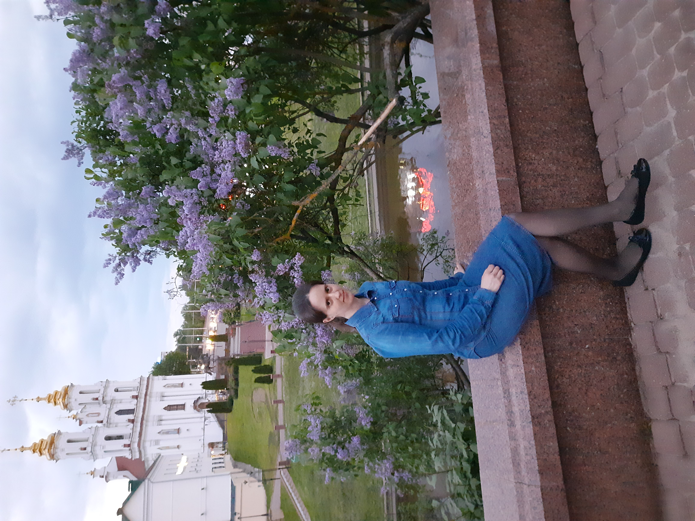

# __HANNA PANKRATSYEVA__



## ***Contact info***
|**Type of contact**|**Contact**|
|:----:|:----:|
|*Email*|*ann_morozova_vit@mail.ru*|
|*Phone number*|+375333709549|

## ***About myself***
I have a degree in engineering and technology for public catering facilities. I worked in a restaurant for 3 years, then moved to medicine as a senior administrator. I have no experience in the IT field, but I have always wanted to learn a remote profession and earn a good income. I set goals and work towards them. I hope everything will work out. My English level is A1, and I am working on improving my language skills.
## ***Skills***
There are no programming language skills.
## ***Code examples***
```typescript
let message: string = 'Hello, World!';
 
// Создаем заголовок
let heading = document.createElement('h1'); 
heading.textContent = message;
 
// Добавляем заголовок в документ
document.body.appendChild(heading);
```
## ***Work experience***
No work experience available
## ***Education***
I have no IT education. I have started studying at RSSchool.
## ***English***
I started taking an Elementary English course at the Aspect language center. I also use the Simpler app.
